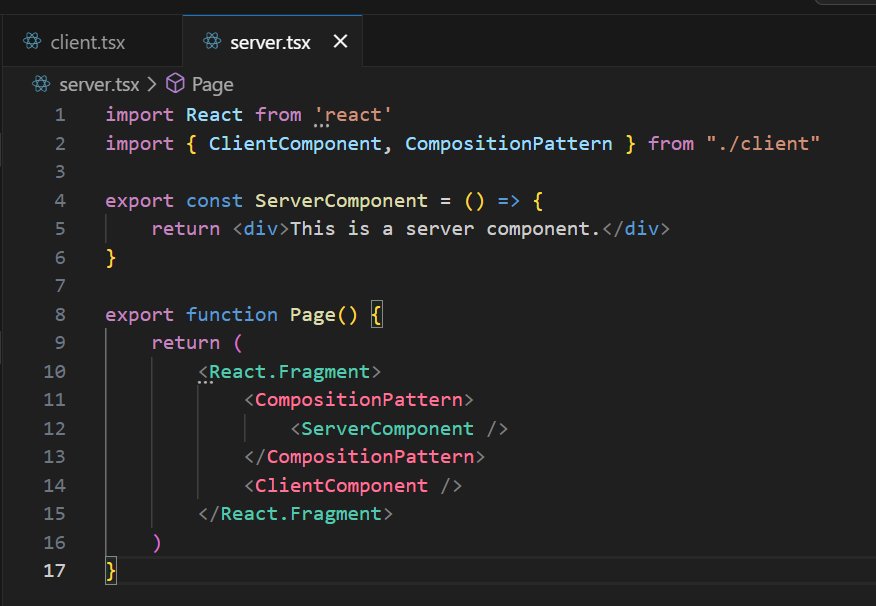

# React Component Color

A VS Code extension that provides visual color coding for React components based on whether they are Server Components or Client Components in modern React applications.

## Features

- 🎨 **Visual Component Identification**: Automatically detects and color-codes JSX/TSX components
- 🔍 **Smart Detection**: Identifies Server vs Client Components by analyzing `'use client'` directives
- ⚙️ **Highly Customizable**: Configure colors for background, border, underline, and text separately
- 🔄 **Real-time Updates**: Instantly updates colors as you edit your code
- 📁 **Import Resolution**: Follows import chains and supports TypeScript path mappings
- 💾 **Performance Optimized**: Uses intelligent caching for fast analysis




## How It Works

The extension analyzes your React files and intelligently determines component types:

- **Server Components**: Components without `'use client'` directive and no client-only features (default: green)
- **Client Components**: Components with `'use client'` directive OR components that use client-only features (default: pink)

### Client-Only Feature Detection

The extension automatically detects components that require client-side execution by analyzing:

- **Event handlers**: `onClick`, `onSubmit`, `onChange`, `onFocus`, etc.
- **React hooks**: `useState`, `useEffect`, `useCallback`, `use`, etc.
- **Custom hooks**: Functions starting with "use" that call other hooks
- **Browser APIs**: `window`, `document`, `localStorage`, `alert`, `fetch`, etc.

This means even without explicit `'use client'` directives, components are correctly identified based on their actual usage patterns.

## Usage

1. Install the extension
2. Open any `.jsx`, `.tsx`, `.js`, or `.ts` file with React components
3. Components are automatically color-coded based on their type
4. Use the command palette and run "Toggle React Component Highlighting" to enable/disable

## Configuration

Customize the extension in your VS Code settings:

```json
{
  "reactComponentColor.enable": true,
  "reactComponentColor.serverComponent.backgroundColor": "",
  "reactComponentColor.serverComponent.borderColor": "",
  "reactComponentColor.serverComponent.underlineColor": "",
  "reactComponentColor.serverComponent.textColor": "#4EC9B0",
  "reactComponentColor.clientComponent.backgroundColor": "",
  "reactComponentColor.clientComponent.borderColor": "",
  "reactComponentColor.clientComponent.underlineColor": "",
  "reactComponentColor.clientComponent.textColor": "#FF719B"
}
```

### Available Settings

| Setting | Description | Default |
|---------|-------------|---------|
| `reactComponentColor.enable` | Enable/disable the extension | `true` |
| `reactComponentColor.serverComponent.*` | Color settings for Server Components | Various |
| `reactComponentColor.clientComponent.*` | Color settings for Client Components | Various |

For each component type, you can configure:

- `backgroundColor`: Background highlight color
- `borderColor`: Border color around the component
- `underlineColor`: Underline color
- `textColor`: Text color of the component name

Set any color to an empty string (`""`) to disable that particular styling.

## Supported File Types

- `.jsx` - JavaScript with JSX
- `.tsx` - TypeScript with JSX
- `.js` - JavaScript (when containing JSX)
- `.ts` - TypeScript (when containing JSX)

## Commands

- **Toggle React Component Highlighting**: Enable/disable component highlighting

## Advanced Features

### Import Resolution

The extension intelligently follows import statements to determine component types:

- Supports relative imports (`./Component`)
- Supports TypeScript path mappings (`@/components/Button`)
- Handles index file resolution
- Works with various import patterns (named, default, namespace)

### Performance

- Intelligent caching system for fast re-analysis
- Efficient AST parsing using TypeScript compiler API
- Minimal performance impact on VS Code

## Requirements

- VS Code 1.100.0 or higher
- Works best with React 19+ projects using Server/Client Components

## Known Issues

- External package imports are not analyzed for component type

## Acknowledgements

This extension was inspired by the original idea from [react-component-colors](https://github.com/SupremeDeity/react-component-colors) by SupremeDeity. We extend our gratitude for the innovative concept of visually distinguishing React component types.

## Contributing

Found a bug or want to contribute? Visit our [GitHub repository](https://github.com/kage1020/react-component-color).

## Release Notes

### 1.0.3

- Enhanced client-only feature detection
- Fixed unexpected server component colorization issues

---

**Enjoy coding with better visual React component identification!** 🚀
